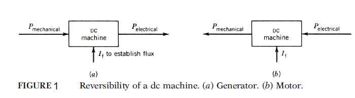

## Introduction

<b>Discipline | <b> Electrical Engineering 
:--|:--|
<b> Lab | <b> **Control and Instrumentation Lab**
<b> Experiment|     <b> **Study and operation of the DC Speed / Position control set up and Experiment 10**

### About the Experiment 
**System description**

<b>DC Motors</b>

The dc machine can operate both as a generator and as a motor. This is illustrated in Fig.below.When it operates as a generator, the input to the machine is mechanical power,and the output is electrical power. A prime mover rotates the armature of the dc machine, and dc power is generated in the machine. The prime mover can be a gas turbine,a diesel engine, or an electrical motor. When the dc machine operates as a motor, the input to the machine is electricalpower, and the output is mechanical power.If the armature is connected to a dc supply, the motor will develop mechanical torque and power. In fact, the dc machine is used more as a motor than as a generator.

DC motors can provide a wide range of accurate speed and torque control.In both modes of operation (generator and motor) the armature winding rotates in the magnetic field and carries current.

                  

<b>Name of Developer | <b> **Prof. Alok Kanti Deb**
:--|:--|
<b> Institute | <b>  **Indian Institute of Technology Kharagpur**
<b> Email id|     <b>  **alokkanti@ee.iitkgp.ac.in**
<b> Department |  **Department of Electrical Engineering**
<b>Webpage| <b> http://www.iitkgp.ac.in/department/EE/faculty/ee-alokkanti

### Contributors List

SrNo | Name | VLabs Developer or Integration Engineer | Designation | Department| Institute
:--|:--|:--|:--|:--|:--|
1 | **Piyali Chattopadhyay** | Developer & Integration | Project Scientist | Department of Electrical Engineering | IIT Kharagpur | 
