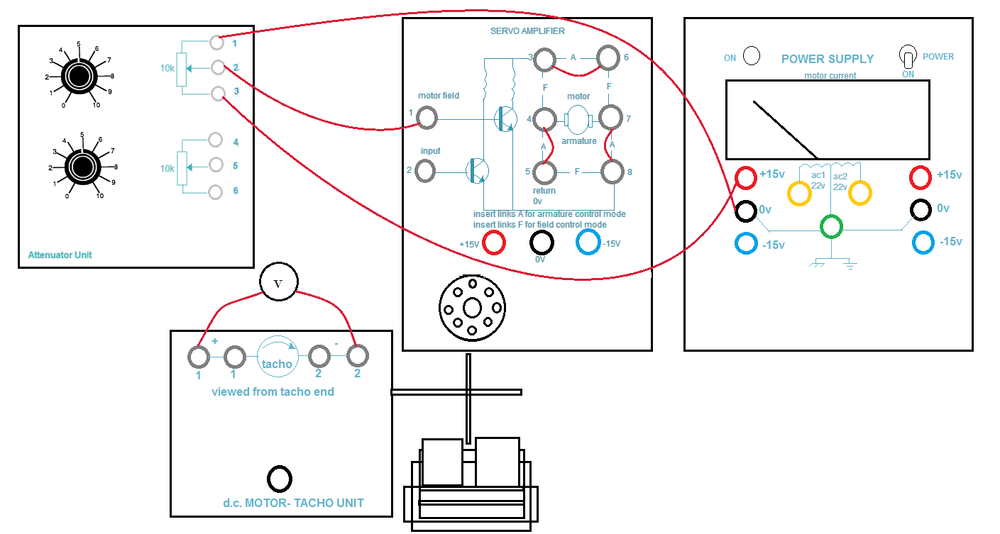
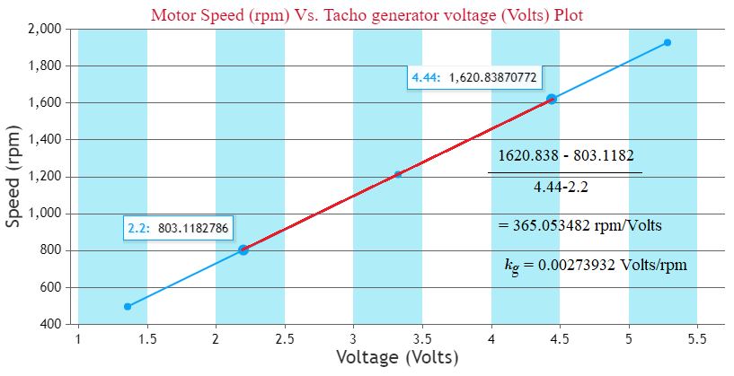
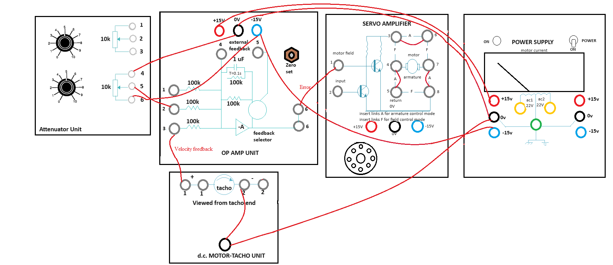
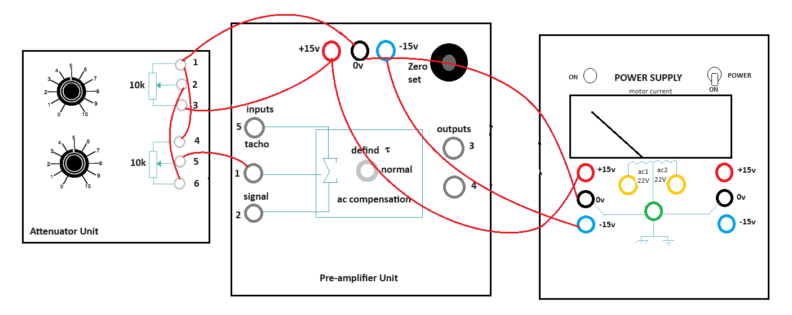
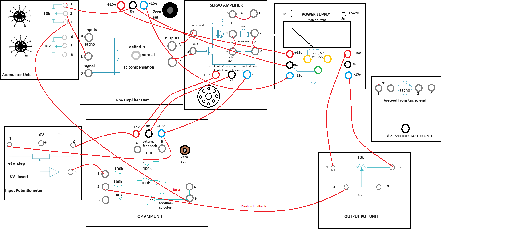

### Procedure

**Steps to perform the simulation**

<ol>
<b>Find Tacho Generator Constant</b>  

  

<b>Fig. 1. Wire Connection for finding Tacho Generator Constant</b>

								
 

<li>First connect the circuit diagram properly through the connecting dots (black dots) according to the instructions below in simulation page.  

<ul>
<li><b>Note:</b> Example: connection point 1 - connection point 2 (drag the wire from connection point 1 by pressing left mouse button and release on connection point 2).</li>
<li>Attenuator Unit upper potentiometer point 1 - Power Supply 0 V (left one).</li> 
<li>Attenuator Unit upper potentiometer point 3 - Power Supply +15 V (left one)</li>
<li>Attenuator Unit upper potentiometer point 2 - Servo Amplifier point 1</li>
<li>Servo Amplifier point (3-6, 4-5, 7-8).</li>
<li><b>Note:</b> Any wire connection can be deleted by clicking on the connected wire if required.</li>
</ul></li> 

<li><ul><li>Click on 'Check Connection' button to check whether the connection is proper or not.</li>
<li>Click on the 'Power' switch in Power Supply box, the led will glow.</li></ul></li> 

<li><ul><li>Rotate the upper potentiometer knob in Attenuator Unit.</li>
<li><b>Note:</b> To rotate any knob put the mouse cursor on the knob handle, a hand symbol will be showing. Press left mouse button, rotate clockwise to increase or anticlockwise to decrease values.</li>
<li><b>Note:</b> If the desired value does not appear while rotating the knob in one attempt, try rotating it back and forth to reach the correct value.</li>
<li>Observe the tacho generator voltage in the black box above dc motor tacho unit plate.</li>
<li>Rotate the knob untill the tacho generator voltage is about 1 V and motor starts rotating, observe the speed of the motor.</li></ul></li> 

<li><ul><li>Now click on 'Show Table' button to get the observation data.</li>
<li>Check output around 2, 3, 4 and 5 volts of tacho generator following steps 3-4 and click on 'Show Table' button
each time after increasing the voltage.</li></ul></li> 

<li><ul><li>Click on 'Plot' button to observe the plot 'Motor Speed (rpm) Vs. Tacho generator voltage (Volts)'</li>
<li>Calculate the tacho generator constant (<i>k</i>g)
from the slope in 'Motor Speed (rpm) Vs. Tacho generator voltage (Volts)' plot as shown in Fig. 2.</li>
<li>Enter the value of <i>k</i>g in corresponding box beside observation table.</li>
<li>Click on 'Download Plot' button to download the plot.</li></ul></li> 

 

<b>Fig. 2. Calculation of Tacho Generator Constant (<i>k</i>g)</b>

								
 					

<li> Rotate the potentiometer knobs to its minimum value to stop the motor, switch off the power. Click on 'Clear' button</li>  
</ol>

<ol> 
<b>Speed Control (Open Loop and Closed Loop)</b>  

  

<b>Fig. 3. Wire Connection for Closed Loop Speed Control</b>

 

<li>First connect the circuit diagram properly through the connecting dots (black dots) according to the instructions below.  

<ul><li>Attenuator Unit lower potentiometer point 4 - Op Amp Unit 0 V</li>
<li>Attenuator Unit lower potentiometer point 5 - Op Amp Unit point 2</li>					  
<li>Attenuator Unit lower potentiometer point 6 - Op Amp Unit -15 V</li>
<li>Op Amp Unit point 6 (upper one) - Servo Amplifier point 1</li>
<li>Servo Amplifier point (3-6, 4-5, 7-8)</li>
<li>Op Amp Unit +15 V - Power Supply +15 V (left one)</li>
<li>Op Amp Unit -15 V - Power Supply -15 V (left one)</li>
<li>Op Amp Unit 0 V - Power Supply 0 V (left one)</li>
<li>DC motor tacho unit lower point - Power Supply 0 V</li>
<li>DC motor tacho unit lower point - DC motor tacho unit point 2 (first one).</li>
<li><b>Note:</b> Any wire connection can be deleted by clicking on the connected wire if required.</li>
</ul>

</li> 

<li><ul><li>Click on 'Check Connection' button to check whether the connection is proper or not.</li>
<li>Click on the 'Power' switch in Power Supply box, the led will glow.</li></ul></li> 

<li><ul><li>Rotate the lower potentiometer knob in Attenuator Unit. Observe the reference voltage, error voltage and Speed.</li> 
<li>Rotate the knob untill the motor starts rotating at around 2000 rpm.</li>
<li>Observe the tacho generator voltage in the black box above dc motor tacho unit plate.</li>
<li>Click on 'Show Table' button to get the observation data.</li></ul></li> 

<li><ul><li>Now click on the plus sign on 'Brake Change' to set the magnetic braking (loading) arrangement to point 2.</li>
<li>Observe the change in speed and tacho generator voltage.</li></ul></li>  

<li><ul><li>Now click on 'Show Table' button to observe the observation table.</li>
<li>Change brake position from 2-10 in step of 2 and check speed, tacho generator voltage 
following step 4 and click on 'Show Table' button each time after changing brake position.</li></ul></li> 

<li><ul><li>Now click on 'Plot' button to observe the plot 'Motor Speed (rpm) Vs. Braking Load (units)'.</li>
<li>Click on 'Download Plot' button to download the plot.</li></ul></li> 

<li> Rotate the potentiometer knobs to its minimum value to stop the motor, switch off the power. Click on 'Clear' button.</li> 

<li>Now make the circuit connection following step 1 and connect the velocity error feedback (Op Amp Unit point 3 - DC motor tacho unit point 1 (first one)) for closed loop control
and follow steps 2-6 again.</li> 

<li><ul><li>Click on 'Pre amplifier Characteristics' button to observe the characteristics of the pre amplifier</li>
<li>Click on 'Position Control' button to perform the experiment of controlling the position of the motor rotor.</li>
<li>To perform the experiment of controlling the speed of the motor click on 'Speed Control' button.</li></ul></li> 
</ol>

  

<ol>
<b>Pre Amplifier Characteristics</b>  

  
<b>Fig. 4. Wire Connection for Pre Amplifier Characteristics</b>

 

<li>First connect the circuit diagram properly through the connecting dots (black dots) according to the instructions below.  

<ul><li>Attenuator Unit upper potentiometer point 1 - lower potentiometer point 4</li>
<li>Attenuator Unit upper potentiometer point 2 - lower potentiometer point 6</li>
<li>Attenuator Unit upper potentiometer point 3 - Pre Amplifier Unit +15 V</li>
<li>Attenuator Unit upper potentiometer point 1 - Pre Amplifier Unit 0 V</li>
<li>Attenuator Unit lower potentiometer point 5 - Pre Amplifier Unit point 1</li>
<li>Power Supply +15 V (left one) - Pre Amplifier Unit +15 V</li>
<li>Power Supply -15 V (left one) - Pre Amplifier Unit -15 V</li>
<li>Power Supply 0 V (left one) - Pre Amplifier Unit 0 V</li>
<li><b>Note:</b> Any wire connection can be deleted by clicking on the connected wire if required.</li>
</ul>					  
</li> 

<li><ul><li>Click on 'Check Connection' button to check whether the connection is proper or not.</li>
<li>Then click on the 'Power' switch in Power Supply box, the led will glow.</li></ul></li> 

<li><ul><li>Rotate the lower potentiometer knob in Attenuator Unit. Observe the input voltage in the black box above.</li>
<li>Rotate the knob untill the voltage is about +1.5 V, the Pre Amplifier outputs Vo(3) and Vo(4) are shown in respective boxes.</li></ul></li> 

<li><ul><li>Click on 'Show Table' button to get the observation data.</li>
<li>Rotate the lower potentiometer knob anti clockwise to decrease the input voltage upto 0 value.</li>
<li>Click on 'Show Table' button each time after decreasing the voltage in 0.1 V step.</li></ul></li> 

<li><ul><li>Now change the connection to apply -15 V as supply voltage.</li>
<li>This can be achieved by deleting the connection Attenuator Unit upper potentiometer point 3 - Pre Amplifier Unit +15 V by clicking on the 
connected wire and connecting Attenuator Unit upper potentiometer point 3 - Pre Amplifier Unit -15 V.</li>
<li>Click on 'Check Connection' button to make sure that proper connection has been done.</li></ul></li> 

<li><ul><li>Now Rotate the lower potentiometer knob in Attenuator Unit in clockwise direction.</li>
<li>Observe the input voltage in the black box above.</li>
<li>Rotate the knob to increase the voltage in -0.1 V step untill -1.5 V, the Pre Amplifier outputs Vo(3) and Vo(4) are shown in respective boxes.</li>
<li>Click on 'Show Table' button each time after increasing the voltage.</li></ul></li> 

<li><ul><li>After the total procedure (steps 3-6) is complete for +1.5 V to -1.5 V input voltage</li>
<li>Click on 'Plot' button to observe the plot 'Pre Amplifier output voltages (Vo(3) and Vo(4)) (Volts) Vs. Input voltage (Vi) (Volts)'.</li>
<li>Hover on the plot section, click on the camera icon to download the plot.</li></ul>
</li>  

<li> Rotate the potentiometer knob to its minimum value ,switch off the power. Click on 'Clear' button.</li> 

<li><ul><li>Click on 'Position Control' button to perform the experiment of controlling the position of the motor rotor.</li>
<li>Click on 'Pre Amplifier Characteristics' button to observe the characteristics of the Pre Amplifier.</li>
<li>To perform the experiment of controlling the speed of the motor click on 'Speed Control' button.</li></ul></li> 

</ol>

  

<ol> 
<b>Position Control</b>  

 
<b>Fig. 5. Wire Connection for Position Control</b>

 

<li>First connect the circuit diagram properly through the connecting dots (black dots) according to the instructions below.  

<ul><li>Attenuator Unit upper potentiometer point 1 - Pre Amplifier Unit 0 V</li>
<li>Attenuator Unit upper potentiometer point 2 - Pre Amplifier Unit point 1</li>					  
<li>Attenuator Unit upper potentiometer point 3 - Op Amp Unit point 6 (lower one)</li>
<li>Pre Amplifier Unit point 3 - Servo Amplifier point 1</li>
<li>Pre Amplifier Unit point 4 - Servo Amplifier point 2</li>
<li>Op Amp Unit +15 V - Input Potentiometer point 2</li>
<li>Op Amp Unit -15 V - Input Potentiometer point 1</li>
<li>Op Amp Unit point 1 - Input Potentiometer point 3</li>
<li>Power Supply +15 V (right one) - Output Pot Unit point 1</li>
<li>Power Supply -15 V (right one) - Output Pot Unit point 2</li>
<li>Op Amp Unit point 2 - Output Pot Unit point 3 (first one)</li>
<li>Op Amp Unit +15 V - Servo Amplifier +15 V</li>
<li>Op Amp Unit -15 V - Servo Amplifier -15 V</li>
<li>Op Amp Unit 0 V - Servo Amplifier 0 V</li>
<li>Servo Amplifier point (3-6, 4-5, 7-8)</li>
<li>Pre Amplifier Unit +15 V - Power Supply +15 V (left one)</li>
<li>Pre Amplifier Unit -15 V - Power Supply -15 V (left one)</li>
<li>Pre Amplifier Unit 0 V - Power Supply 0 V (left one).</li>
<li><b>Note:</b> Any wire connection can be deleted by clicking on the connected wire if required.</li>
</ul>

</li> 

<li><ul><li>Click on 'Check Connection' button to check whether the connection is proper or not.</li> 
<li>Click on the 'Power' switch in Power Supply box, the led will glow.</li></ul></li> 

<li><ul><li>Rotate the upper potentiometer knob in Attenuator Unit upto 8.</li>
<li>Click on 'Rotate Pot' button clockwise arrow sign to rotate Input Potentiometer cursor to an arbitrary angle (ex:+10&deg;).</li>
<li>Observe the output potentiometer (Output Pot Unit) cursor angle.</li>
<li>Click on 'Show Table' button to get the observation data, observe the misalignment there.</li></ul></li> 

<li>Now take 5 readings for different angles in clockwise direction following step 3 and click on 'Show Table' button each time after changing input cursor angle.</li>  

<li><ul><li>Now click on 'Rotate Pot' button counter clockwise arrow sign to rotate Input Potentiometer cursor to an arbitrary angle (ex:-10&deg;).</li>
<li>Observe the output potentiometer cursor angle.</li>
<li>Click on 'Show Table' button to get the observation data, observe the misalignment there.</li></ul></li> 

<li>Now take 5 readings for anticlockwise rotation following step 5 and click on 'Show Table' button each time after changing input cursor angle.</li>  

<li> Rotate the upper potentiometer knob to its minimum value, switch off the power. Click on 'Clear' button.</li> 

<li><ul><li>To perform the experiment of controlling the speed of the motor click on 'Speed Control' button.</li>
<li>Click on 'Pre Amplifier Characteristics' button to observe the characteristics of the Pre Amplifier.</li>
<li>Click on 'Position Control' button to perform the experiment of controlling the position of the motor rotor.</li></ul></li> 
</ol>

  