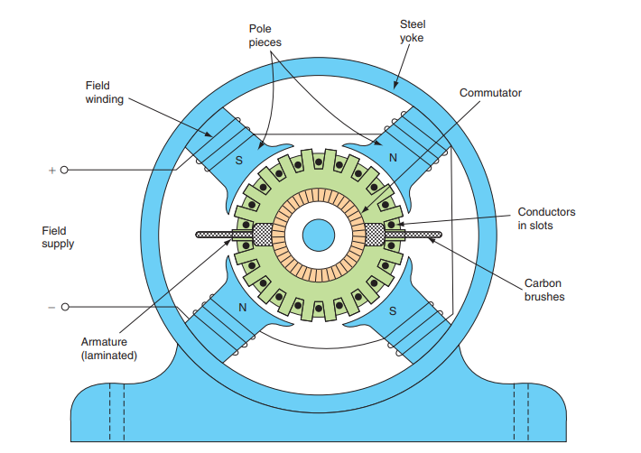
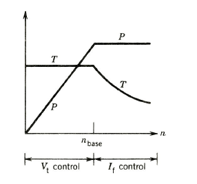
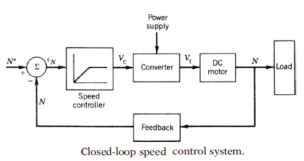

# Theory

 <b style="color:blue">DC Machine:</b>

In the dc machine, the field winding is placed on the stator and the armature winding on the rotor.A dc current is passed through the field winding to produce flux in the machine. Voltage induced in the armature winding is alternating. A mechanical commutator and a brush assembly function as a rectifier or inverter, making the armature terminal voltage unidirectional.

				

                  

				
<b>Application:</b>

Although a dc machine can operate as either a generator or a motor, at present its use as a generator is limited because of the widespread use of ac power. The dc machine is extensively
used as a motor in industry. Its speed can be controlled over a wide range with relative ease.Large dc motors (in tens or hundreds of horsepower) are used in machine tools, printing presses, conveyors, fans, pumps, hoists, cranes, paper mills, textile mills, rolling mills, and so forth. Additionally, dc motors still dominate as traction motors used in transit cars and locomotives.Small dc machines (in fractional horsepower rating) are used primarily as control devices—such as tachogenerators for speed sensing and servomotors for positioning and	tracking.The dc machine definitely plays an important role in industry. 
				
<b style="color:blue">Speed Control of D.C. Motors:</b>

The term ‘speed control’ stands for intentional speed variation, carried out manually or automatically. Natural speed change due to load, is not included in the term ‘speed control’.D.C. motors are most suitable for wide range speed control and are, therefore, indispensable for many adjustable speed drives.The speed of a d.c. motor is given by below equation.
				
$$\omega = \frac{V_t - I_a r_a}{K_a \Phi}$$
				
where 
				
$$K_a = \frac{PZ}{2\pi a}$$
				
there are basically three methods of speed control and these are :
				
(i) Variation of resistance in the armature circuit,
(ii) Variation of the field flux, and
(iii) Variation of the armature terminal voltage.
				
Before describing these methods, it is preferable to define the terms base speed, speed	regulation, speed range, constant power drive and constant torque drive.
				
<b>Base Speed:</b>

It is defined as the speed at which a motor runs at rated armature voltage and rated field current. Base speed is equal to the rated speed or nameplate speed of the motor.
				
<b>Speed regulation:</b>

If the speed-change from no load to full load is &Delta;&omega;m then speed regulation is defined as the ratio of &Delta;&omega;m to rated speed (or base speed) &omega;m
								
The percentage speed regulation = 
				
$$\frac{\Delta \omega_m}{\omega_m}\times 100$$
				
<b>Speed range</b>

It is defined as the ratio of the maximum allowable speed to minimum allowable speed of the motor. When the speed range of a motor is specified, it must be mentioned 
				whether this speed range is at no-load, full load or a fraction of full load.
				
<b>Constant power drive:</b>

If the motor shaft power (shaft torque x speed) remains constant over a given speed range, the system is called a constant power drive. Note that in constant power drive, higher torques are available at lower speeds and lower torques at higher speeds.The motor size is always decided by the highest torque requirement at the lowest speed.

<b>Constant torque drive:</b>

If the motor shaft torque remains constant over a given speed range, the system is called a constant torque drive. Note that in constant torque drive, shaft power varies as the speed varies.
				
<b>Magnetic Braking:</b>

Conventional braking systems in cars and bicycles utilise the friction force between two objects pressed together to slow an object down. By making use of eddy currents,magnetic braking can be achieved where the electromagnetic force between a magnet and a conductor in motion is used to create a repulsive and slowing force. If a conductor moves past a stationary magnet, eddy currents will be induced in the conductor by the magnet, according to Faraday’s law of induction.Eddy currents create their own magnetic field that opposes the original magnetic field of the magnet. This in turn creates a drag force between the magnet and the conductor,which slows the conductor down.A permanent magnet or an electromagnet can be used to create the magnetic field in a magnetic brake. The advantage of using an electromagnet is that the magnet,and hence the braking system, can be turned on and off by adjusting the current in the electromagnet’s windings.A big advantage with magnetic braking is the lack of physical contact between components, which makes for low maintenance and few replacement parts. A disadvantage with magnetic braking is that when there is no motion between the magnet and conductor,there is no static force to maintain the conductor at rest. In this case, the magnetic braking system would need to be supplemented by a friction­ based (conventional) braking system
like a hand brake.
				

<b>Speed Control</b>
				
There are numerous applications where control of speed is required, as in rolling mills, cranes,hoists, elevators, machine tools, and transit system and locomotive drives.DC motors are extensively used in many of these applications. Control of the speed of dc motors below and above the base (or rated) speed can easily be achieved.Besides, the methods of control are simpler and less expensive than those applicable to ac motors. The technology of speed control of dc motors has evolved considerably over the past quarter-century. In the classical method, a Ward–Leonard system with rotating machines is used for speed control of dc motors. Recently,solid-state converters have been used for this purpose. In this section, various methods of speed control of dc motors are discussed.

<b>1. Vt Control:</b>

In the armature voltage control mode, the motor current Ifm is kept constant at its rated value.The generator field current Ifg is changed such that Vt changes from zero to its rated value. The speed will change from zero to the base speed. The torque can be maintained constant during operation in this range of speed, as shown in Fig. below. 

<b>2.If Control:</b>
				
The field current control mode is used to obtain speed above the base speed. In this mode, the	armature voltage Vt remains constant and the motor field current Ifm is decreased (field weakening) to obtain higher speeds. The armature current can be kept constant, thereby	operating the motor in a constant-horsepower mode. The torque obviously decreases as speed increases, as shown in Fig. below.
				
<b>3. Armature Resistance Control Method</b>

The armature resistance control is based on the principle that the speed of the motor is directly proportional to the back EMF.So, if the supply voltage and the armature resistance are kept at a constant value, the speed of the motor will be directly proportional to the armature current. 
				

                 

				
Besides these there are other speed control methods like ward leonard system , Solid-state control using Choppers and controlled rectifiers etc.
				
<b>Closed loop operation:</b>
				
DC motors are extensively used in many drives where speed control is desired. In many applications where a constant speed is required, open-loop operation of dc motors may not be satisfactory. In open-loop operation, if load torque changes, the speed will change, too. In a closed-loop system, the speed can be maintained constant by adjusting the motor terminal voltage as the load torque changes. The basic block diagram of a closed-loop speed control system is shown in Fig.below. If an additional load torque is applied, the motor speed momentarily decreases and the speed error increases, which increases the control signal Vc.The control signal increases the converter output voltage (the control signal decreases the firing angle if the converter is a phase-controlled rectifier, or increases the duty ratio if the converter is a chopper). An increase in the motor armature voltage develops more torque to restore the speed of the motor. The system thus passes through a transient period until the developed torque matches the applied load torque.
				

                

				
There are other advantages of closed-loop operation, such as greater accuracy, improved dynamic response, and stability of operation. In a closed-loop system the drive characteristics can also be made to operate at constant torque or constant horsepower over a certain speed range, a requirement in traction systems. Circuit protection can also be provided in a closed-loop system. In fact, most industrial drive systems operate as closed-loop feedback systems.
				
<b> Some important Formulas:</b>
				
if V is the supply voltage, Eb is the back emf produced and Ia, Ra are the armature current and armature resistance respectively then the voltage equation is given by,
				
$$V = E_b + I_a R_a ----(1)$$ 
				
we multiply both sides of equation (1) by Ia
				
$$V I_a = E_b I_a + I_a^{2} R_a ----(2)$$ 
				
Now Ia2Ra is the power loss due to heating of the armature coil, and the true effective mechanical power that is required to produce the desired torque of DC machine is given by,
				
$$p_m = E_b I_a -----------(3)$$
				
The mechanical power Pm is related to the electromagnetic torque Tg as,
				
$$p_m = T_g \omega -----------(4)$$
				
Where, &omega; is speed in rad/sec.Now equating equation (3) and (4) we get,
				
$$E_b I_a = T_g \omega -----------(5)$$
				
Now for simplifying the torque equation of DC motor we substitute.
				
$$E_b = \frac{P \phi Z N}{60A} -----------(6)$$ 
				
Substituting equation (5) and (6) in equation (3), we get:
				
$$T_g = \frac{P \phi Z I_a}{2\pi A} -----------(7)$$ 
				
This is the torque equation of DC motor. It can be further simplified as:
				
$$T_g = K_a \phi I_a$$
				
where,
				
$$K_a = \frac{PZ}{2 \pi A}$$ 
				
Where, P is no of poles,

&phi; is flux per pole,

Z is no. of conductors,

A is no. of parallel paths,

and N is the speed of the DC motor
						
						
								