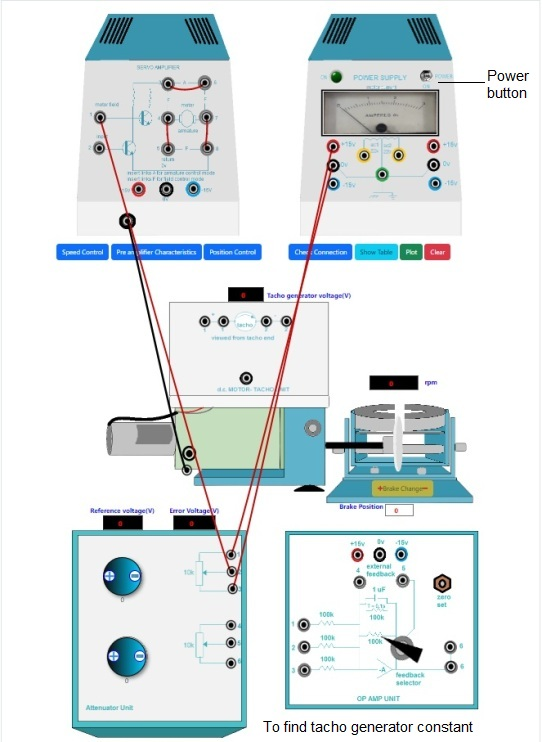
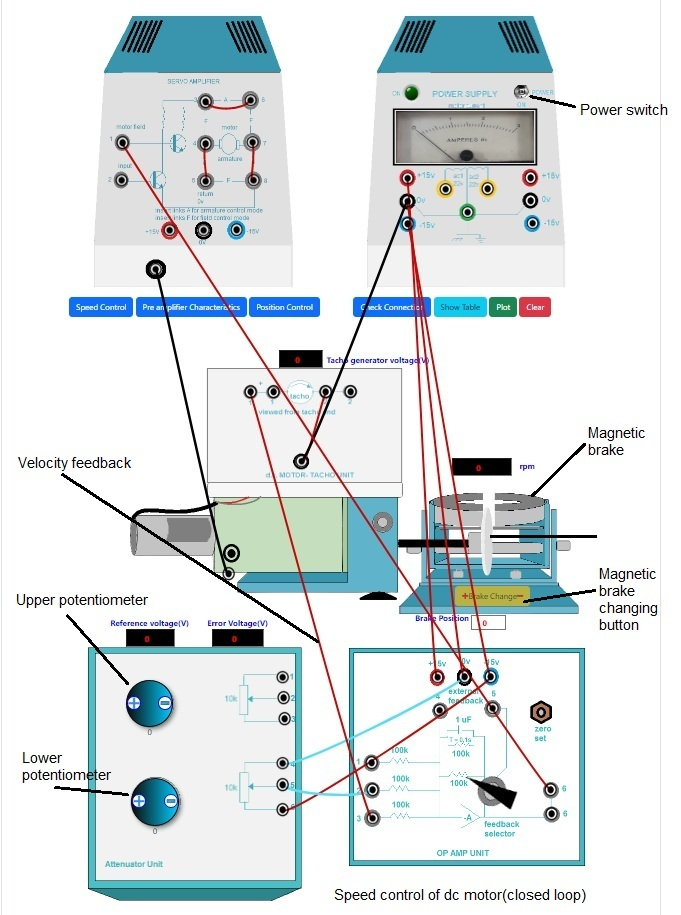
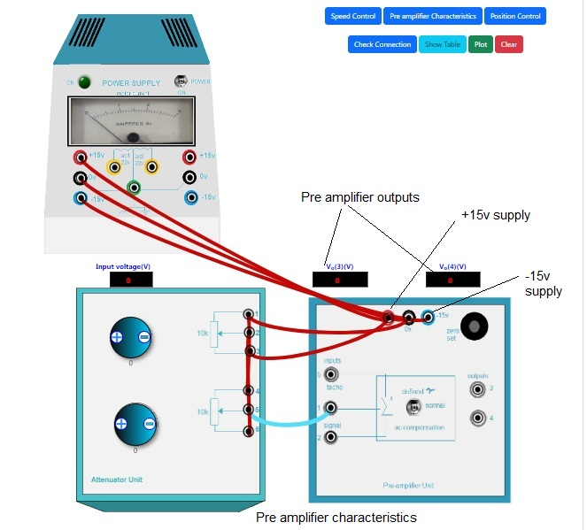
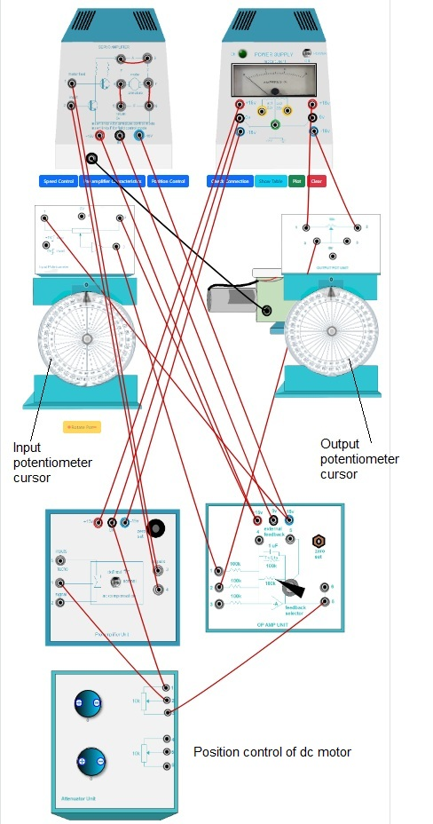

### Procedure
				

**Steps to perform the simulation**

Find Tacho generator Constant
					
1. At first connect the circuit diagram properly through the connecting dots(black dots)according to below instruction.

Attenuator unit upper potentiometer point 1-power supply 0v(left one),Attenuator unit upper potentiometer point 3-power supply +15v(left one),Attenuator unit upper potentiometer point 2-servo amplifier point 1,servo amplifier point(3-6,4-5,7-8).
  
2. Click on 'Check Connection' button to check whether the connection is proper or not.Then click on the 'Power' switch in Power Supply box ,the led will glow.
					 
3. Rotate the upper potentiometer knob in Attenuator Unit by clicking on the plus sign on it.Observe the tacho generator voltage in the black box above dc motor tacho unit plate.Rotate the knob untill the voltage is about 1v and motor starts rotating,see the speed.

4. Now click on 'Show Table' button to observe the observation table.Check output around 2,3,4,5 volts of tacho generator in same way and click on 'Show Table' button each time after increasing voltage.
					 
5. Now click on 'Plot' button to observe the plot 'Motor speed(rpm) vs. Tacho generator voltage(Vg)' and see the result i.e. tacho generator constant(Kg).
					 
6. Rotate the potentiometer knobs to its minimum value to stop the motor,switch off the power.Click on 'Clear' button. 
			 

								  

		    

Speed Control(Open loop and Closed loop)

1. At first connect the circuit diagram properly through the connecting dots(black dots)according to below instruction.

Attenuator unit lower potentiometer point 4-Op Amp Unit 0v, Attenuator unit lower potentiometer point 5-Op Amp Unit point 2,Attenuator unit lower potentiometer point 6-Op Amp Unit -15v, Op Amp Unit point 6(upper one)- Servo Amplifier point 1,servo amplifier point(3-6,4-5,7-8),Op Amp Unit +15v - Power Supply +15v, Op Amp Unit -15v - Power Supply -15v, Op Amp Unit 0v - Power Supply 0v,DC motor tacho unit lower point - Power Supply 0V, DC motor tacho unit lower point - DC motor tacho unit point 2(first one).
					  
2. Click on 'Check Connection' button to check whether the connection is proper or not.Then click on the 'Power' switch in Power Supply box ,the led will glow.
					 
3. Rotate the lower potentiometer knob in Attenuator Unit by clicking on the plus sign on it.Observe the Reference voltage,Error Voltage and speed.Rotate the knob untill the motor starts rotating at around 2000 rpm.Observe the tacho generator voltage in the black box above dc motor tacho unit plate.click on 'Show Table' button to observe the observation table.
					 
4. Now click on 'Brake Change' button plus sign to set the magnetic braking(loading) arrangement to point 2.Observe the change in speed and tacho generator voltage.

5. Now click on 'Show Table' button to observe the observation table.Now change brake position from 2-10 in step of 2 and check speed and tacho generator voltage in same way and click on 'Show Table' button each time after changing brake position.
					 
6. Now click on 'Plot' button to observe the plot 'Motor speed(rpm) vs. Braking load(in Units)'.

7. Rotate the potentiometer knobs to its minimum value to stop the motor,switch off the power.Click on 'Clear' button.

8. Now do the same connection as step-1 and connect the velocity error feedback(Op Amp Unit point 3- DC motor tacho unit point 1(first one)) for closed loop control.and follow steps 2-7 again.
					
9. Click on 'Pre amplifier Characteristics' button to observe the characteristics of the pre amplifier , click on 'Position Control' button to perform the experiment of controlling the position of the motor rotor.To perform the experiment of controlling the speed of the motor click on 'Speed Control' button.

Pre amplifier Characteristics
					
1. At first connect the circuit diagram properly through the connecting dots(black dots)according to below instruction.

Attenuator unit upper potentiometer point 1-lower potentiometer point 4,Attenuator unit upper potentiometer point 2-lower potentiometer point 6,Attenuator unit upper potentiometer point 3-Pre amplifier unit +15v, Attenuator unit upper potentiometer point 1-Pre amplifier unit 0v,Attenuator unit lower potentiometer point 5-Pre amplifier unit point 1, Power Supply +15v - pre amplifier unit +15v, Power Supply -15v - pre amplifier unit -15v,Power Supply 0v - pre amplifier unit 0v.					  
					  
2. Click on 'Check Connection' button to check whether the connection is proper or not.Then click on the 'Power' switch in Power Supply box ,the led will glow.
					 
3. Rotate the lower potentiometer knob in Attenuator Unit by clicking on the plus sign on it.Observe the input voltage in the black box above.Rotate the knob untill the voltage is about +1.5v ,the pre amplifier outputs Vo(3)and Vo(4)are shown in respective boxes.

4. Now click on 'Show Table' button to observe the observation table.Click on minus sign on the lower potentiometer knob to decrease the input voltage upto 0 value.and click on 'Show Table' button each time after changing the voltage.
					 
5. Now change the connection to apply -15v as supply voltage.This can be achieved by Deleting the connection Attenuator unit upper potentiometer point 3-Pre amplifier unit +15v by clicking on the wire and connecting Attenuator unit upper potentiometer point 3-Pre amplifier unit -15v.Click on 'Check Connection' button to make sure that proper connection has been done.
					 
6. Now Rotate the lower potentiometer knob in Attenuator Unit by clicking on the plus sign on it.Observe the input voltage in the black box above.Rotate the knob to increase the voltage in -0.1v step untill -1.5v ,the pre amplifier outputs Vo(3)and Vo(4)are shown in respective boxes.Click on 'Show Table' button each time after changing the voltage.
					 
7. After the above procedure is complete for +1.5v to -1.5v input voltage, click on 'Plot' button to observe the plot 'Pre amplifier output voltages(Vo(3)and Vo(4))(volts) vs. Input voltage(Vi)'. 
					 
8. Rotate the potentiometer knob to its minimum value ,switch off the power.Click on 'Clear' button.</li> 

9. Click on 'Position Control' button to perform the experiment of controlling the position of the motor rotor.Click on 'Pre amplifier Characteristics' button to observe the characteristics of the pre amplifier , To perform the experiment of controlling the speed of the motor click on 'Speed Control' button.

           

Position Control

1. At first connect the circuit diagram properly through the connecting dots(black dots)according to below instruction.

Attenuator unit upper potentiometer point 1-Pre amplifier Unit 0v, Attenuator unit upper potentiometer point 2-Pre amplifier Unit point 1,Attenuator unit upper potentiometer point 3-Op Amp Unit point 6(lower one), Pre amplifier Unit point 3- Servo Amplifier point 1,Pre amplifier Unit point 4- Servo Amplifier point 2,Op Amp Unit +15v - input potentiometer point 2,Op Amp Unit -15v - input potentiometer point 1,Op Amp Unit point 1 - input potentiometer point 3,Power Supply +15v(right one) - output pot unit point 1,Power Supply -15v(right one) - output pot unit point 2,Op Amp Unit point 2 - output pot unit point 3(1st one),Op Amp Unit +15v - servo amplifier +15v, Op Amp Unit -15v - servo amplifier -15v, Op Amp Unit 0v - servo amplifier 0v,servo amplifier point(3-6,4-5,7-8),pre amplifier Unit +15v - Power Supply +15v(left one), pre amplifier Unit -15v - Power Supply -15v(left one),pre amplifier Unit 0v - Power Supply 0v(left one)

2. Click on 'Check Connection' button to check whether the connection is proper or not.Then click on the 'Power' switch in Power Supply box ,the led will glow.</li> 
					 
3. Rotate the upper potentiometer knob in Attenuator Unit by clicking on the plus sign on it upto 8.Click on 'Rotate Pot' button plus sign to rotate input potentiometer cursor to an arbitrary angle(ex:+10&deg;).Observe the output potentiometer cursor angle.Click on 'Show Table' button to show the observation table,observe the misalignment there.
					 
4. Now take 5 readings for clockwise raotation in same way and click on 'Show Table' button each time after changing input cursor angle.
					 
5. Now,click on 'Rotate Pot' button minus sign to rotate input potentiometer cursor to an arbitrary angle(ex:-10&deg;).Observe the output potentiometer cursor angle.Click on 'Show Table' button to show the observation table,observe the misalignment there.

6. Now take 5 readings for anticlockwise raotation in same way and click on 'Show Table' button each time after changing input cursor angle.

7. Rotate the upper potentiometer knob to its minimum value ,switch off the power.Click on 'Clear' button.
					
8. To perform the experiment of controlling the speed of the motor click on 'Speed Control' button.Click on 'Pre amplifier Characteristics' button to observe the characteristics of the pre amplifier , click on 'Position Control' button to perform the experiment of controlling the position of the motor rotor.

           

